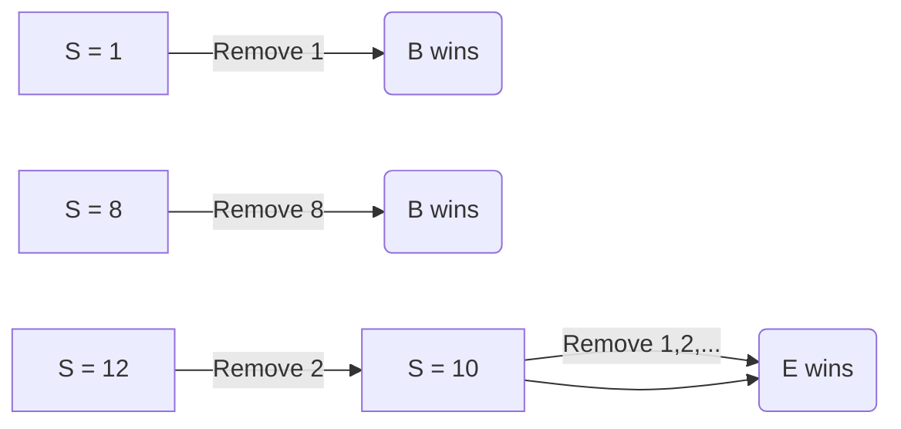

# the problem

<!--
speaker_note: |
  the problem is straightforward: (_show first_) two players play a game with a
  pile of `S` stones. (_show second_) on each turn, a player removes any positive
  palindrome number (`p`) of stones, and (_show third_) the player who cannot move
  on their turn **loses**. to solve the problem, (_show fourth_) we need to
  determine who wins, given `S`, which is the number of stones in the pile.
-->

<!-- jump_to_middle -->
<!-- incremental_lists: true -->

1. start with `S` stones
2. player takes turn removing `p` **palindrome** number of stones
3. player who cannot move on their turn _loses_
4. given `S`, determine who _wins_

<!-- end_slide -->

<!-- alignment: center -->

# definitions

<!--
speaker_note: |
  before starting working on the code however, we need to understand a few
  definitions. first, what is a palindrome? well, it is a number that reads the
  same backwards and forwards; like `12,321` (_spoken_), (_show number on
  slide_),or just `12321` (_by digit_). it can also be a single digit (_show
  second number on slide_) -- since it only have 1 digit, it is the same backwards
  and forwards. that means, natural numbers from `1` to `9` are allowed. there is
  one case that is explicitly disallowed in the problem: leading zeros are **not**
  allowed. that means a number like (_show third number on slide_) `300` is
  **not** a valid palindrome. finally, a palindrome must be a natural number, with
  0 (zero) excluded.

  second -- we need to explicitly define what is a **winning position** and what
  is a **losing position**. a **winning position** is when a player has a number
  of stones (or `S`) where they can make a move that forces the other player in a
  **losing position**. and a **losing position** is where no matter what move the
  current player makes, the other player will be in a **winning position**; or if
  there are no stones left for them to move.
-->

<!-- column_layout: [1, 1, 1] -->

<!-- column: 0 -->
<!-- alignment: center -->
<!-- jump_to_middle -->

**palindrome**

<!-- incremental_lists: true -->

- 12,321 ✅
- 1, 2, 3, ..., 9 ✅
- 300 ❌
- p ∈ ℕ

<!-- column: 1 -->
<!-- alignment: center -->
<!-- jump_to_middle -->

**winning position**

<!-- pause -->

forces the opponent in a **losing position**

<!-- pause -->
<!-- column: 2 -->
<!-- alignment: center -->
<!-- jump_to_middle -->

**losing position**

<!-- pause -->

no matter what move was made, the opponent is in a **winning position**

<!-- end_slide -->

# example

<!--
speaker_note: |
  now lets show how a round work with an example. (_show input_) for the inputs,
  we have `3` for the number of test cases, and three numbers following that,
  which corresponds to the number of stones to start with; or `S`.

  for the output, i have aligned them with the input, and each line of input
  corresponds to a line of output. as we can see, the program outputs `B`, `E`,
  and `B`, which indicates which player will win, if all player plays the optimal
  moves. `B` and `E` are the initials of the players in the game, as you can find
  on the problem sheet.

  here's how the players will move for each input of `S`.

  (_make a 3 column table_)

  | S  | first move                                  | outcome                |
  | -- | ------------------------------------------- | ---------------------- |
  | 8  | take 8                                      | first player (B) wins  |
  | 10 | any move -> leaves win for other player (E) | second player (E) wins |
  | 12 | take 2 -> leaves losing position for E      | B wins                 |

  for `8`, the first player can simply take all `8` stones, as the number `8` is a
  palindrome according to our definition, therefore, the first player wins.

  next, when `S` is `10`, the first player can take any number of stones from `1`
  to `9` -- as they are all palindromes -- and it will put the other player in a
  **winning position**, since `10` minus any number from `1` to `9` will also
  leave a palindrome number for the other player; making the first player in a
  **losing position**, according to our definition.

  for the final example, when `S` is `12`, the first player's optimal move is to
  take `2` stones, which leaves `10` for the other player; and from our last
  example, they will be in a **losing position** as all valid moves they make will
  lead to a **winning position** for the first player.

  here is a diagram for a simple visualization: (_show diagram_)
-->

<!-- pause -->
<!-- column_layout: [1, 1] -->
<!-- column: 0 -->
<!-- alignment: center -->

## input

```sh
3    # number of test cases
8    # S = 8
10   # S = 10
12   # S = 12
```

<!-- column: 1 -->
<!-- alignment: center -->
<!-- pause -->

## output

```sh
.    # no output, period added for alignment
B    # bessie (the first player) wins
E    # elsie  (the second player) wins
B    # ...
```

<!-- pause -->
<!-- reset_layout -->
<!-- alignment: left -->



<!-- end_slide -->

# example, continued

<!--
speaker_note: |
  let's try a couple more examples. (_show table_)

  as shown from before, when `S` is from `1` to `9`, it is a **winning position**;
  and it is a **losing position** when it is `10`; and then it becomes like
  before, where it is a **winning position** again.

  maybe you can see a pattern after trying a bunch of inputs -- that if `S` ends
  in `0`, the current player always **lose**; and if `S` ends in any other digit,
  the current player can always **win**.
-->

<!-- alignment: center -->
<!-- pause -->

| S   | outcome              |
| --- | -------------------- |
| 1   | take all, winning ✅ |
| 2   | winning ✅           |
| 3   | winning ✅           |
| 4   | winning ✅           |
| 5   | winning ✅           |
| ... | winning ✅           |
| 9   | winning ✅           |
| 10  | take any, losing ❌  |
| 11  | take 1, winning ✅   |
| 12  | take 2, winning ✅   |
| ... | winning ✅           |
| 20  | take any, losing ❌  |
| 30  | losing ❌            |
| 40  | losing ❌            |

<!-- end_slide -->

# theorem

<!--
speaker_note: |
  now with that pattern in mind, we can establish this theorem. (_show theorem_)
  it states that if the number of stones ends in a `0` (zero) -- which is a
  multiple of `10` -- then the current player will **lose** -- no matter what they
  do.

  if the number is not a multiple of `10`, then the current player can always make
  a move that forces the other player into a **losing position**, creating a
  **winning position**.
-->

<!-- alignment: center -->
<!-- jump_to_middle -->

for any number of stones `S` > 0:

```latex +render
$ S \in \text{winning} \iff S \not \equiv 0 \pmod{10} $
```

```latex +render
$ S \in \text{losing} \iff S \equiv 0 \pmod{10} $
```

`S` is a **losing position** _if and only if_ it ends in zero.

<!-- end_slide -->

# proof

<!--
speaker_note: |
  with the theorem in mind, we now need to prove it is true. we can prove this
  with strong induction; (_show content_) and it works in two steps:

  first, we need to establish the base case -- meaning that we need show our rule
  works for the first few, smallest numbers. (_show bullet_) in our game, we
  checked that the rule holds true for numbers like `1`, `2`, all the way up to
  `10`.

  then, the inductive step (_show bullet_) -- we have to show that the rule will
  work for all natural numbers k between `0` and `S` exclusive. if we can prove
  that the rule works for all numbers smaller than a certain number S, then it
  must also work for S.
-->

<!-- alignment: center -->
<!-- jump_to_middle -->
<!-- pause -->

proof by **strong induction** on `S`.

<!-- column_layout: [1, 1] -->
<!-- column: 0 -->
<!-- pause -->

## base step

<!-- incremental_lists: true -->

- show the theorem works for the first few numbers

<!-- column: 1 -->

## inductive step

- show the theorem works for all number `k` -- where `k ∈ ℕ` and `0 < k < S`.

<!-- end_slide -->

# proof, continued

<!--
speaker_note: |
  now we look at two scenarios:

  (_show left_) on the left, we have **case 1**, where our starting number `S` is
  a multiple of `10`. the formula shows what happens when we subtract any
  palindrome number, `p`. since `S mod 10` is just `0`, the remainder of our new
  pile, `S'`(S prime), is whatever `0 - (p mod 10)` is. and since we know
  palindromes can't end in `0`, `p mod 10` is never `0`. so, the result is never
  `0` either. this means any move the current player make puts our opponent on a
  number that doesn't end in `0`, which we know from our assumption is a **winning
  position** for them. that makes the current player's starting spot a **losing
  position**.

  on the right, we have **case 2**, where `S` does not end in a `0`. here we make
  our clever move, which the first line of the formula shows: we define our
  palindrome `p` to be the last digit of `S`. the math then shows that our new
  pile, `S'`, becomes `S - p`. by definition, this new number is now a multiple of
  `10`, so its remainder is `0`, forcing our opponent into a **losing position**.
  that means the starting position of the current player must be **a winning
  position**.

  and so, by strong induction, we've shown that our rule works for all possible
  values of `S`: numbers ending in `0` are losing, and everything else is winning.
-->

<!-- column_layout: [1, 1] -->
<!-- column: 0 -->
<!-- alignment: center -->
<!-- pause -->

## case 1: S ≡ 0 (mod 10)

```latex +render
$$
\begin{aligned}
S' \pmod{10} &= (S-p) \pmod{10} \\
             &= (0 - (p \pmod{10})) \pmod{10} \\
\end{aligned}
$$
```

<!-- column: 1 -->
<!-- pause -->

## case 2: S ≢ 0 (mod 10)

```latex +render
$$
\begin{aligned}
S'           &= S - p \\
S'           &= S - (S \pmod{10}) \\
S' \pmod{10} &= S - (S \pmod{10}) \pmod{10} \\
(S \pmod{10}) - (S \pmod{10})) &= 0 \pmod{10} && \text{(subtraction)} \\
\end{aligned}
$$
```

<!-- end_slide -->

# code

<!--
speaker_note: |
  with that in mind, we can now start writing the c++ code, which is quite
  straightforward; we just have to check the last digit of the input `S`, which is
  the amount of stones in the pile. if it ends with zero, we can know that the
  second player (`E`) wins. otherwise, the first player (`B`) wins.
-->

<!-- alignment: center -->

```cpp
#include <iostream>
#include <string>

void solve() {
  std::string s; // string to handle huge input
  std::cin >> s;
  if (s.back() == '0') {
    std::cout << "E" << std::endl;
  } else {
    std::cout << "B" << std::endl;
  }
}

int main() {
  int tc; // amount of test cases
  std::cin >> tc;
  while (tc--) {
    solve();
  }
  return 0;
}
```

_a simple `if` statement will suffice_

<!-- end_slide -->
<!--alignment: center -->
<!-- jump_to_middle -->

# thank you!
